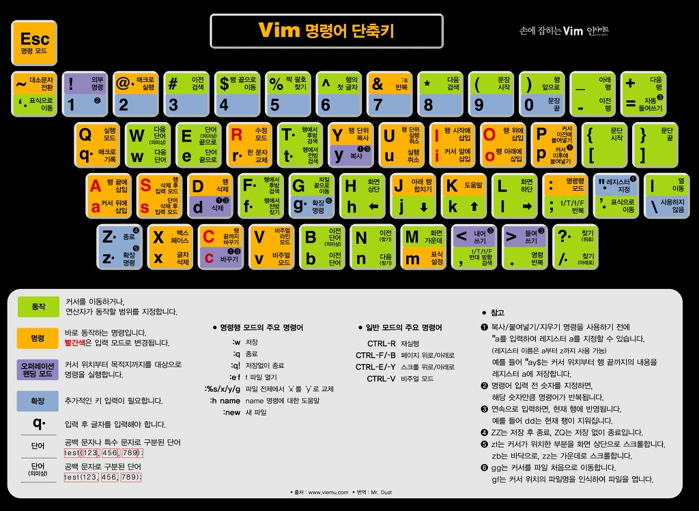
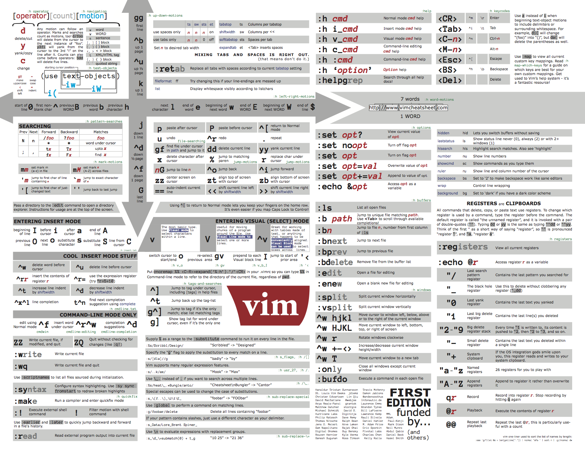

# VIM 편집기

VIM에 대한 가장 끝판왕 정리는 [simple_vim_guide](https://github.com/leedh/simple_vim_guide)이다.

**목차**

- VIM 종료 명령
- 커서 이동 명령
- 삽입 명령
- 삭제 명령
- 복사 명령
- 바꾸기 명령
- 이동
- 검색
- Cheat sheet

## VIM 종료 명령

`:q` : 그대로 종료하기(quit)

`:q!` : 변경된 내용을 저장하지 않고 강제로 종료하기

`:wq` : 변경된 내용을 저장하고 종료하기(write and quit)

`:x` : :wq와 동일한 명령

## 커서 이동 명령

### 기본이동

`h` : 왼쪽으로 커서 한칸 이동

`l` : 오른쪽으로 한칸 이동

`k` : 커서를 한 라인 뒤로 이동

`j` : 커서를 한 라인 아래로 이동

`gg` : 커서를 텍스트의 맨 처음 라인으로 이동

`G` : 커서를 텍스트의 마지막 라인으로 이동

`숫자G` : 커서를 숫자 라인만큼 이동

### 현재 보이는 페이지 기준 이동

`H` : 화면의 처음으로 이동

`M` : 커서를 화면 중간 라인으로 이동

 `L` : 화면 끝으로 이동

### 단어 단위로 이동

`e` : 다음 단어의 마지막으로 이동 / `E` : 커서를 공백으로 구분된 다음 단어 끝으로 이동

`b` : 한 단어 뒤로 이동 / `B` : 커서를 공백으로 구분된 이전 단어로 이동

`w` : 커서를 한 단어 뒤로 이동 / `W` : 커서를 공백으로 구분된 다음 단어로 이동

### 한 문장 내에서의 이동

`0` : 커서를 라인의 시작으로 이동

`$` : 커서를 라인의 끝으로 이동

`^` : 문장 맨 앞으로 커서 이동

### 페이지 이동

`ctrl+f` : 다음 화면으로 이동

`ctrl+d` : 화면의 반만 앞으로 이동

`ctrl+b` : 전 화면으로 이동

`ctrl+u` : 화면의 반만 뒤로 이동

### {} 중괄호(curly brace)를 기준으로 이동

`]]` : `{` 로 커서 이동 (forward 방향), 없으면 페이지의 맨 아래로 커서 이동, `{` 은 가장 상위의 블록을 감싸고 있는 문자만 찾는다.

`[[` : `{`로 커서 이동 (backward 방향)

`][` : `}` 로 커서 이동 (forward 방향), 없으면 페이지의 맨 위로 커서 이동, `}`은 가장 상위의 블록을 감싸고 있는 문자만 찾는다.

`[]` : `}`로 커서 이동 (backward 방향)

`%` : `{}`나 `()`에서 현재 괄호의 짝으로 커서 이동

`enter` : 커서를 다음 라인 시작으로 이동

`-` : 커서를 라인의 처음으로 이동

`"` : 커서를 전 위치로 이동

`(` : 문장의 시작으로 이동

`{` : 문단의 시작 위치로 이동

`)` : 문장 끝으로 이동하여 다음 단어의 시작으로 커서 이동

`}` : 문단 끝으로 이동

## 삽입 명령

`i` : 커서 앞에 입력 (insert)

`I` : 라인 시작 부분에 입력

`a` : 커서 뒤에 입력

`A` : 라인 끝에 입력

`o` : 커서 있는 라인 밑에 출력

`O` : 커서가 있는 라인 위에 입력

## 삭제 명령

`x` : 커서가 있는 문자 삭제

`X` : 커서가 있는 문자 앞의 문자 삭제

`dw` : 커서가 있는 단어 삭제

`db` : 커서 앞에 있는 단어 삭제

`dW` : 공백으로 구분된 뒷 단어 삭제

`dB` : 공백으로 구분된 앞 단어 삭제

`dd` : 커서가 있는 라인 삭제

`D` : 커서가 있는 라인의 나머지 삭제

`d)` : 문장의 나머지 삭제

`d}` : 문단의 나머지 삭제

`dG` : 파일의 나머지 삭제

`dH` : 화면의 시작까지 삭제

`dL` : 화면의 나머지 삭제

`J` : 커서와 다음 단어의 공백을 모두 삭제

## 복사 명령

`yw` : 커서가 있는 단어를 복사

`yb` : 커서가 있는 앞 단어를 복사

`yW` : 공백으로 구분된 뒷 단어 복사

`yB` : 공백으로 구분된 앞 단어를 복사

`y` : 특정한 다음 텍스트 복사

`yL` : 화면의 나머지 복사

`yy` : 커서가 있는 라인을 복사, 커서가 가리키는 곳으로 라인을 이동

`y)` : 문자의 나머지 복사

`y}` : 문단의 나머지 복사

`yG` : 파일의 나머지 복사

`yH` : 화면 시작까지 복사

## 바꾸기 명령

`r` : 커서에 있는 문자 대치

`R` : 입력 모드로 한 문자씩 덮어씀

`s` : 커서가 있는 문자 삭제 후 입력 모드로 전환

`S` : 커서가 있는 줄을 삭제한 후 입력 모드로 전환

`cb` : 커서가 있는 앞 문자 삭제 후 입력 모드

`cW` : 공백으로 구분된 뒷 단어를 삭제한 후에 입력 모드

`cB` : 공백으로 구분된 앞 단어 삭제 후 입력 모드

`cc` : 커서가 있는 라인을 삭제하고 입력 모드

`C` : 커서가 있는 라인의 나머지를 삭제하고 입력 모드로 전환

`c0` : 커서에서부터 라인의 시작까지 텍스트 바꾸기

`c` : 특정 테스트 바꾸기

`c)` : 문장의 나머지 바꾸기

`c}` : 문단의 나머지 바꾸기

`cG` : 파일의 나머지 바꾸기

`cm` : 표시까지 모든 것 바꾸기

`cL` : 화면의 나머지 바꾸기

`cH` : 화면의 시작까지 바꾸기

## 이동

`p` : 삭제나 복사된 텍스트를 커서가 있는 문자나 라인 뒤에 삽입

`P` : 삭제나 복사된 텍스트를 커서가 있는 문자나 라인 앞에 십입

`dw p` : 커서가 있는 단어를 삭제한 후 이를 변경한 커서 있는 것 뒤에 삽입

`dw P` : 커서가 있는 단어를 삭제한 후 이를 변경한 커서 있는 곳 앞으로 삽입

`d p` : 지정한 다음 텍스트로 삭제한 후 커서가 가리키는 곳으로 이동

`d) P` : 문장의 나머지로 이동

`d} P` : 문단의 나머지로 이동

`dG P` : 파일의 나머지로 이동

`dH P` : 화면 시작 부분으로 이동

`dL P` : 화면의 나머지를 이동

## 검색

`슬래시(/) 키`는 패턴 검색을 위한 명령

슬래시 명령을 입력하면 화면 하단에 슬래시가 표시되는데 이 뒤에 여러분이 원하는 검색 단어를 입력해 주면 커서가 있는 곳부터 시작하여 검색 패턴을 찾아 주게 됩니다.

`/pattern` : 텍스트에서 앞으로 패턴 검색

`>pattern` : 텍스트에서 뒤로 패턴 검색

`n` : 앞 또는 뒤로 이전 검색 반복

`N` : 반대 방향으로 이전 검색 반복

`dW` : 공백으로 구분된 뒷 단어 삭제

`dB` : 공백으로 구분된 앞 단어 삭제

`/` : 전 검색을 앞으로 반복

`?` : 전 검색을 뒤로 반복

## Cheat sheet

## 참고

- [vi/vim 명령어 모음](https://inpages.tistory.com/124)
- [vim 유용한 단축키 정리](https://gmlwjd9405.github.io/2019/05/14/vim-shortkey.html)

