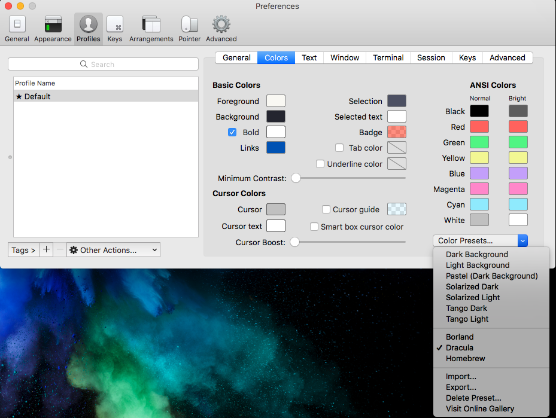

# 나만의 shell 만들기


## ※ 문제

shell 을 이쁘게 꾸미고 싶었다. 또한, macOS에 기본 내장된 bash를 쓰는 것보다 zsh를 쓰는게 생산성도 높혀준다.


## ※ 해결

아래의 절차와 방법을 따라 만들었다.

### 1. iterm2 설치

[iterm2 다운로드 페이지](https://www.iterm2.com/downloads.html)에 가서 stable releases의 최신 버전을 다운로드 받는다.


### 2. HomeBrew 설치

`HomeBrew`는 프로그램 패키지를 관리해주는 프로그램이다. 각종 패키지를 다운로드받기 위해 먼저 이 녀석을 다운로드 받는다. [Homebrew 홈페이지](https://brew.sh)


아래의 명령어를 터미널에 입력한다.

```shell
$ /usr/bin/ruby -e "$(curl -fsSL https://raw.githubusercontent.com/Homebrew/install/master/install)"
```


### 3. zsh 설치

`zsh`는 `bash`에 추가적인 명령어를 추가하고 편의성을 개선한 새로운 shell이다. 한가지 예로 git 폴더 상태를 관리해주고 터미널의 상태를 나타내주는 기능이 있다.

`zhs`는 방금 설치한 `brew`를 통해서 설치할 수 있다.

``` $ brew install zsh```


### 4. oh my zsh 설치

`oh my zsh`는 `zsh`를 좀더 편리하게 이용하게 도와주는 일종의 `zsh`용 plug in이다.

즉,  iTerm2는 앱, Zsh는 셸, Oh my Zsh!는 Zsh의 설정을 관리하는 프레임워크이다.

```shell
$ sh -c "$(curl -fsSL https://raw.github.com/robbyrussell/oh-my-zsh/master/tools/install.sh)"
```

`oh my zsh`가 제공하는 기본 plug in은 [여기](https://github.com/robbyrussell/oh-my-zsh/wiki/Plugins) 나와있다.


##### [잠깐!]

oh my zsh를 설치하고 난 후, 터미널에 `$ open ~/.zshrc`를 치면 아래와 같은 텍스트파일을 볼 수 있다. 이곳에서 custormizing을 해준다. 


(참고) zshrc에서 rc는 *run command*의 약자란다.


### 4-1. 추가 plug in 설치

기본 plug in 외에 [zsh-syntax-highlighting](https://github.com/zsh-users/zsh-syntax-highlighting)과 [zsh-autosuggestions](https://github.com/zsh-users/zsh-autosuggestions)를 설치한다.

```shell
$ git clone https://github.com/zsh-users/zsh-syntax-highlighting.git ${ZSH_CUSTOM:-~/.oh-my-zsh/custom}/plugins/zsh-syntax-highlighting
```

```shell
$ git clone git://github.com/zsh-users/zsh-autosuggestions $ZSH_CUSTOM/plugins/zsh-autosuggestions
```


plug in을 설치한 후에는 반드시 `~/.zshrc`파일에 설정을 해줘야 한다. 파일을 열고 plugins 항목에 플러그인을 추가한다.

```
plugins=(
  git
  zsh-syntax-highlighting
  zsh-autosuggestions
)
```

설정파일을 수정한 후에는 터미널을 재시작하거나 `source ~/.zshrc` 명령어를 실행하여 설정을 다시 불러와야 한다. 이제 명령어를 입력할 때 존재하지 않는 명령어는 빨간색으로 뜨고 한번 입력했던 명령어는 회색으로 나타나는 걸 확인할 수 있다.


### 4-2. oh my zsh팁

1. 명령어가 기억나지 않으면 `tab`
2. cd ../.. 대신 `...`, `....`, `.....`, …
3. 단축명령어 - `git status` => `gst`, `git pull` => `gl` 등등 [다양한 단축명령어](https://github.com/robbyrussell/oh-my-zsh/wiki/Plugin:git)


### 5. colour scheme 고르기

`iterm`에는 많은 colour scheme이 있다. [이곳](https://iterm2colorschemes.com)에서 이미 설정된 scheme들을 다운로드 받은 후 **iterm > preferences > profile > colors**로 간다.




import누르고 `Dracula.itermcolors`를 고른다. [Dracula Theme](https://github.com/dracula/dracula-theme/)이 내 취향이다.


### 6. fonts 설치

zsh shell에서 특별한 icons를 띄우기 위해서는 특별한 fonts를 설치해줘야 한다.

[여러가지](https://github.com/ryanoasis/nerd-fonts#font-installation)가 있지만 개인적으로 [nerd fonts](https://github.com/ryanoasis/nerd-fonts#option-4-homebrew-fonts)를 설치했다.

아래의 두 명령어를 입력한다.

```shell
$ brew tap caskroom/fonts
```

```shell
$ brew cask install font-hack-nerd-font
```

그리고 나서, **item > preferences > profiles > text > font > Change Font** 에서 Hack Nerd Font를 고른다.

개인적으로 선호하는 셋팅은 글씨크기 *18px* / *Vertical space 120%*


##### [잠깐!]

여기 Font에서 절대 'Use a different font for non-ASCII text'를 체크하지 말자. 이거 하고나서 Non-ASCII Font로 다른 font를 골랐었는데, icon이 안떠서 마음고생 심하게 했다. 그냥 편하게 체크하지 말고, 폰트 하나로만 쓰자.


### 7 . Powerlevel9k 설치

zsh의 여러 themes중 하나로 [powerlevel9k](https://github.com/bhilburn/powerlevel9k/wiki/Install-Instructions#step-1-install-powerlevel9k)가 있다.

일단, powerlevel9k가 방금 설치한 Nerd Font를 사용토록 `~/.zshrc` 에 입력해줘야 한다.

```shell
$ echo "POWERLEVEL9K_MODE='nerdfont-complete'" >> ~/.zshrc
```


그 다음, github에서 `powerlevel9k`를 설치해서 역시 `~/.zshrc`에 삽입한다.

```shell
$ git clone https://github.com/bhilburn/powerlevel9k.git ~/powerlevel9k	
```

```shell
$ echo 'source  ~/powerlevel9k/powerlevel9k.zsh-theme' >> ~/.zshrc
```


##### [잠깐!]

`powerlevel9k`가 시작되기 전에 font가 셋업되어 있어야 한다.

`~/.zshrc`는 위에서부터 아래로 line by line로 명령어를 실행시키기 때문에 순서가 중요하다.

> ```
> POWERLEVEL9K_MODE='nerdfont-complete'
> source ~/powerlevel9k/powerlevel9k.zsh-theme
> ```

반드시 이 순서어야 한다!


### 8. powerlevel9k의 configuration 변경

`~/.zshrc`에서 powerlevel9k의 configuration을 변경할 수 있다. 자세한 내용은 [이곳](https://github.com/bhilburn/powerlevel9k#prompt-customization)을 참고한다.

현재 내가 추가한 셋팅은 다음과 같다.


> POWERLEVEL9K_LEFT_PROMPT_ELEMENTS=(ssh dir vcs newline status)
> POWERLEVEL9K_RIGHT_PROMPT_ELEMENTS=(ssh time)
> POWERLEVEL9K_PROMPT_ADD_NEWLINE=true
>
> # #reversed time format
>
> POWERLEVEL9K_TIME_FORMAT='%D{%H:%M:%S}'


그리고 추가로 [typora](https://typora.io)도 alias로 추가해줬다.

> alias typora="open -a typora"


다른 유저들이 뽐낸 [configuration을 구경](https://github.com/bhilburn/powerlevel9k/wiki/Show-Off-Your-Config)해볼 수도 있다. 


### 그 밖에..

이렇게 애써 설치한 zsh를 uninstall 해야될 때가 있다. 그때는 아래 링크를 참고하자.

[Back to Bash: Remove Zsh and terminal themes on a Mac step-by-step](https://medium.com/the-code-review/back-to-bash-remove-zsh-and-terminal-themes-on-a-mac-step-by-step-f89f69d2ec73)


## 참고

[How you can style your terminal like Medium, freeCodeCamp, or any way you want](https://medium.freecodecamp.org/how-you-can-style-your-terminal-like-medium-freecodecamp-or-any-way-you-want-f499234d48bc#c8bd)

[zsh와 oh-my-zsh의 설치와 사용법](https://aweekj.github.io/zsh/)

[본격 mac에 개발환경 구축하기](https://subicura.com/2017/11/22/mac-os-development-environment-setup.html)

[Z shell with Oh My Zsh Config Guide](https://blog.funspaces.org/2017/02/13/z-shell-with-oh-my-zsh-config-guide/#z-shell-1990년에-나온-shell이-갑자기-왜)

[멋진 Terminal 만들기](https://beomi.github.io/2017/07/07/Beautify-ZSH/)